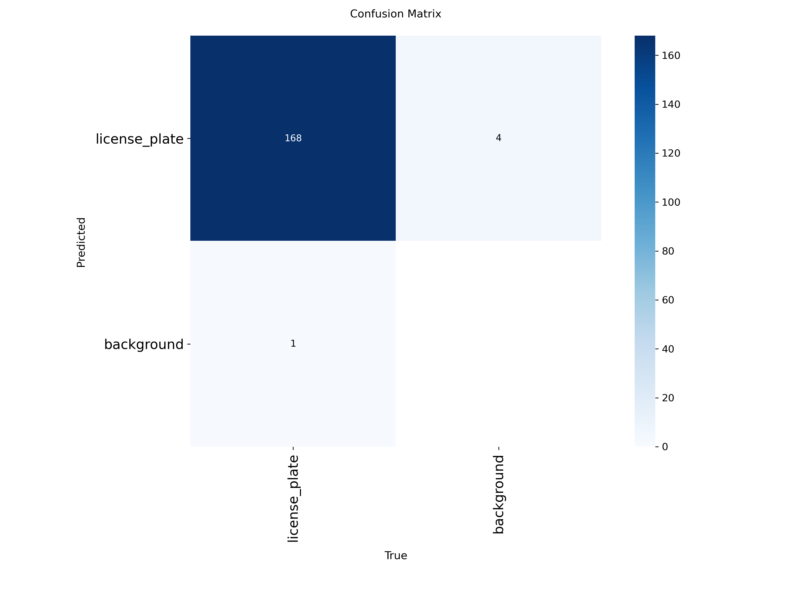
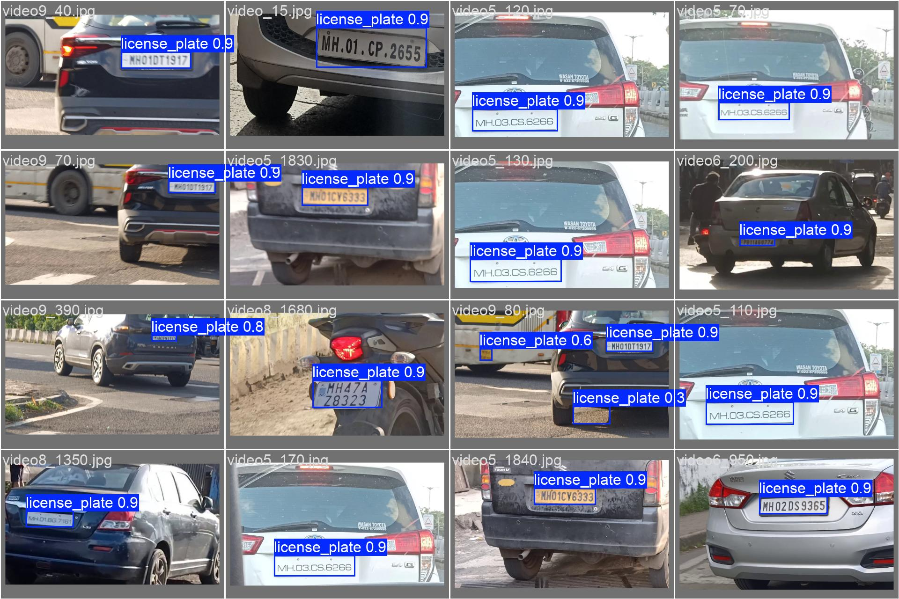

# VC Práctica 4
### Luis Martín Pérez

- Dataset usado para la detección de matrículas: [License Plate Dataset](https://www.kaggle.com/datasets/ronakgohil/license-plate-dataset)
- Video generado a partir de las detecciones del video de prueba: [DetectionsVideo](#)

# Descripción del proyecto.
## Parte 1: YOLO para detección de objetos y matrículas.
### Entrenamiento del modelo para matrículas.

Idealmente, para este caso de uso se tendría que haber elegido un conjunto de datos de matrículas europeas 
exclusivamente, sin embargo, no se puedo encontrar uno con calidad decente. 

Los resultados del entrenamiento junto a los pesos del modelo se encuentra en la carpeta `license-plate-model/`.
Los hiperparámetros se encuentran en `license-plate-model/args.yaml`. A continuación, se muestran las siguientes gráficas:

#### Matriz de confusión.

#### Ejemplo de Batch de Validación.

### Detección de matrículas a partir de video de ejemplo.

Dado el video de ejemplo proporcionado, se siguió el siguiente procedimiento:

- Se captura el vídeo y se analiza fotograma a fotograma.
- Usar el modelo de base YOLOn11 para seguir a personas, bicicletas y coches.
- Si se detectan coches, se le pasa al modelo de matrículas el recorte de la imagen del coche escalada a 640x640, que fue el tamaño de entreno.
- Se trasladan las coordenadas y tamaño del bounding box a la imagen original.
- Se pasa la imagen de la matrícula detectada al modelo OCR tesseract para leer su texto.
- Si los flags `WRITE_VIDEO` y `WRITE_CSV` están habilitadas, se graba el vídeo con las anotaciones y también se escriben los datos en el fichero `detections.csv`.

## Parte 2: Comparación de modelos de OCR para detección de texto de matrículas.

// TODO